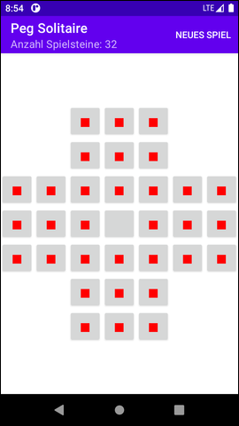
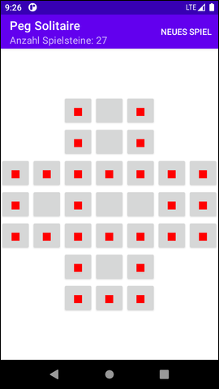

# Android-App: Peg Solitaire #

 

This repository contains the code for a simple [Peg Solitaire](https://en.wikipedia.org/wiki/Peg_solitaire) game as native Android app.
The main purpose of the app is it to demonstrate usage of the [GridLayout](https://developer.android.com/reference/android/widget/GridLayout).

How to solve this game is described [here](https://www.wikihow.com/Win-the-Peg-Solitaire-Game-(English-Board)).

 

----

## Screenshots ##

 

 &nbsp;  

 

----

## License ##

 

See the [LICENSE file](LICENSE.md) for license rights and limitations (BSD 3-Clause License).

 
